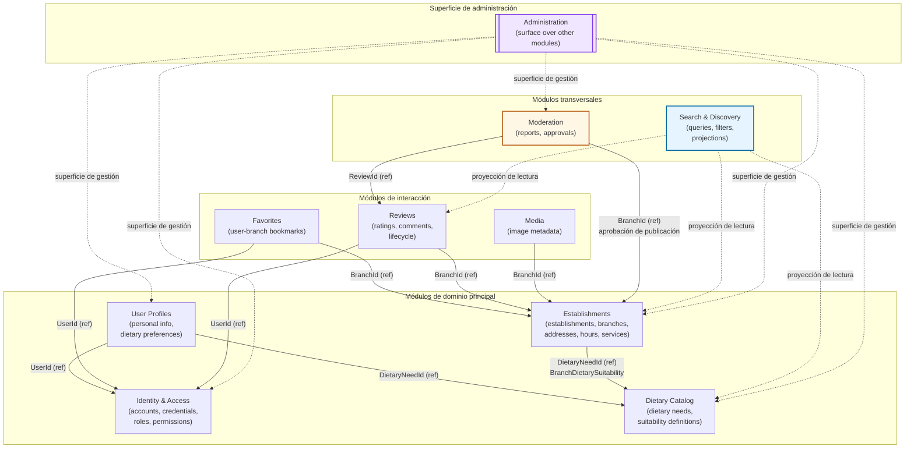

# Mapa de Módulos — Lyria

## Descripción general

Lyria es una plataforma de gastronomía construida como **monolito modular**. Cada módulo encapsula su propio dominio, expone únicamente identificadores hacia el exterior y se comunica con otros módulos a través de eventos de dominio o proyecciones de lectura. No se comparten modelos de entidad entre módulos.

---

## Diagrama de módulos

---

## Tabla de dependencias

| Módulo | Depende de | Tipo de relación |
|---|---|---|
| **Identity & Access** | — | Módulo raíz; sin dependencias hacia otros módulos |
| **User Profiles** | Identity & Access | Referencia por `UserId` |
| **User Profiles** | Dietary Catalog | Referencia por `DietaryNeedId` |
| **Dietary Catalog** | — | Catálogo autónomo; sin dependencias |
| **Establishments** | Dietary Catalog | Referencia por `DietaryNeedId` para `BranchDietarySuitability` |
| **Favorites** | Identity & Access | Referencia por `UserId` |
| **Favorites** | Establishments | Referencia por `BranchId` |
| **Reviews** | Identity & Access | Referencia por `UserId` |
| **Reviews** | Establishments | Referencia por `BranchId` |
| **Media** | Establishments | Referencia por `BranchId` |
| **Moderation** | Reviews | Referencia por `ReviewId` (reportes y ciclo de vida) |
| **Moderation** | Establishments | Referencia por `BranchId` (flujo de aprobación de publicación) |
| **Search & Discovery** | Establishments | Proyección de lectura (solo lectura) |
| **Search & Discovery** | Reviews | Proyección de lectura (solo lectura) |
| **Search & Discovery** | Dietary Catalog | Proyección de lectura (solo lectura) |
| **Administration** | Identity & Access | Superficie de gestión (roles, usuarios) |
| **Administration** | User Profiles | Superficie de gestión |
| **Administration** | Dietary Catalog | Superficie de gestión (catálogos) |
| **Administration** | Establishments | Superficie de gestión |
| **Administration** | Moderation | Superficie de gestión (revisión de reportes) |

---

## Relaciones clave

### Search & Discovery
Consume contratos estables publicados por Establishments, Reviews y Dietary Catalog mediante **proyecciones de lectura**. No accede directamente a los agregados internos de esos módulos ni reutiliza sus entidades de dominio como modelos de consulta. Las proyecciones se materializan como vistas o modelos de consulta optimizados, propios del módulo, actualizados a partir de eventos publicados por los módulos fuente. Search & Discovery trabaja con identificadores y no accede a datos privados de perfiles de usuario ni modifica datos maestros de ningún otro módulo.

### Favorites
Almacena marcadores de tipo usuario–sucursal. Referencia `UserId` del módulo Identity & Access y `BranchId` del módulo Establishments. No duplica información de perfil ni de sucursal.

### Reviews
Registra valoraciones y comentarios de un usuario sobre una sucursal. Referencia `UserId` e `BranchId` como identificadores externos. El ciclo de vida de una reseña (borrador, publicada, eliminada) es gestionado internamente por este módulo.

### Moderation
Procesa reportes sobre reseñas (`ReviewId`) y gestiona el flujo de aprobación de publicación de sucursales (`BranchId`). No posee las entidades de Reviews ni de Establishments; actúa sobre sus identificadores y recibe eventos de dominio.

### User Profiles
Extiende la identidad de un usuario con información personal y preferencias dietéticas. Referencia `UserId` de Identity & Access y `DietaryNeedId` de Dietary Catalog.

### Establishments
Registra establecimientos, sucursales, direcciones, horarios y servicios. Asocia sucursales con necesidades dietéticas mediante `BranchDietarySuitability`, referenciando `DietaryNeedId` del catálogo.

### Media
Gestiona la galería de imágenes de cada sucursal a través del aggregate root `BranchMediaGallery`. Cada sede tiene exactamente una galería, identificada por `BranchId`. Las imágenes individuales (`BranchImage`) son entidades internas de la galería. El módulo referencia `BranchId` del módulo Establishments y no gestiona el almacenamiento físico de archivos; solo persiste metadatos y la referencia al proveedor externo (`StorageKey`).

### Administration
Superficie transversal que opera sobre catálogos, usuarios y roles. No es un módulo de dominio; expone operaciones de gestión delegando en los módulos correspondientes. Se representa de forma diferenciada en el diagrama.

---

## Reglas de comunicación entre módulos

### 1. Comunicación solo por identificadores
Los módulos no comparten modelos de entidad ni objetos de dominio. La única referencia permitida entre módulos es un identificador tipado (por ejemplo, `UserId`, `BranchId`, `ReviewId`).

### 2. Sin modelos de entidad compartidos
Está prohibido referenciar una entidad de otro módulo directamente. Cada módulo define sus propias representaciones internas. Si necesita datos de otro módulo, los obtiene mediante proyecciones o eventos.

### 3. Eventos de dominio para notificaciones cruzadas
Cuando un módulo necesita comunicar un cambio relevante a otros módulos, puede publicar un **evento de dominio**. Los módulos interesados se suscriben al evento sin conocer al publicador. Los eventos de dominio representan hechos de negocio significativos; no son obligatorios para toda operación entre módulos. Cuando existe una necesidad real de atomicidad y los módulos comparten la misma infraestructura de persistencia, la coordinación desde la capa de Application en una misma transacción también es válida. Ejemplos de eventos justificados:
- `ReviewPublished` → consumido por Search & Discovery y Moderation.
- `BranchApproved` → consumido por Search & Discovery.
- `AccountCreated` → consumido por User Profiles.

### 4. Proyecciones de lectura para consultas cruzadas
Cuando un módulo necesita leer datos de otro (sin modificarlos), utiliza una **proyección de lectura** propia. Search & Discovery es el módulo que más aplica este patrón: mantiene proyecciones actualizadas a partir de eventos publicados por Establishments, Reviews y Dietary Catalog.

---

## Mapeo de namespaces (conceptual)

Los siguientes namespaces representan la organización conceptual del dominio. No implican proyectos separados en la solución actual (monolito modular).

| Módulo | Namespace de dominio |
|---|---|
| Identity & Access | `Lyria.Domain.IdentityAccess` |
| User Profiles | `Lyria.Domain.UserProfiles` |
| Establishments | `Lyria.Domain.Establishments` |
| Dietary Catalog | `Lyria.Domain.DietaryCatalog` |
| Favorites | `Lyria.Domain.Favorites` |
| Reviews | `Lyria.Domain.Reviews` |
| Media | `Lyria.Domain.Media` |
| Moderation | `Lyria.Domain.Moderation` |

Search & Discovery y Administration no tienen namespace de dominio propio: Search & Discovery es una capa de consulta y Administration es una superficie de gestión transversal.
