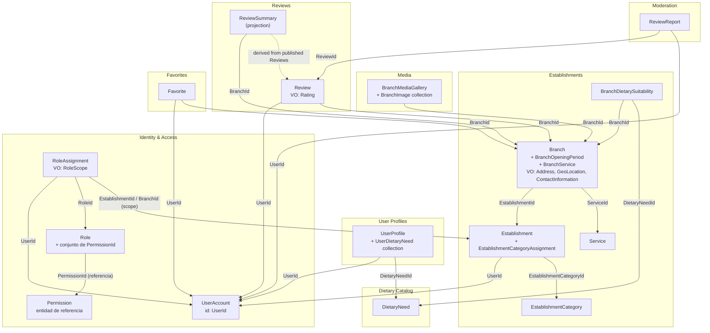

# Límites de Agregados — Lyria

**Fecha:** 2026-07-13
**Estado:** Borrador
**Plataforma:** Lyria — Plataforma de gastronomía

---

## Introducción

Este documento define los límites de los agregados del dominio de Lyria. Cada agregado encapsula un conjunto de entidades y value objects que deben mantenerse consistentes dentro de una misma transacción. Las referencias entre agregados se realizan exclusivamente mediante identificadores (IDs), nunca mediante referencias directas a objetos.

Los principios que guían estas decisiones son:

- **Consistencia transaccional fuerte** dentro del agregado; **coordinación desde la capa de Application** entre agregados, con consistencia eventual cuando el procesamiento secundario puede demorarse.
- **Un repositorio por aggregate root**.
- **Tamaño mínimo**: preferir agregados pequeños y enfocados, salvo que las invariantes de negocio exijan mayor cohesión.
- **Independencia de módulos**: los módulos no se referencian directamente; se comunican mediante eventos de dominio o consultas por ID.
- **Aggregate root ligero**: un agregado ligero (como `Favorite`, `EstablishmentCategory` o `Service`) no es una tabla sin comportamiento. Debe proteger al menos su identidad, su estado y las reglas de su ciclo de vida. La ligereza se refiere al tamaño del agregado (pocas o ninguna entidad interna), no a la ausencia de lógica de dominio.

---

## 1. Tabla resumen de agregados

| Aggregate Root | Módulo | Entidades internas | Value Objects | Referencias cruzadas | Invariantes clave |
|---|---|---|---|---|---|
| `UserAccount` | Identity & Access | — | — | — (es la raíz de identidad) | Credenciales únicas, estado de cuenta coherente |
| `Role` | Identity & Access | — (mantiene conjunto de `PermissionId`) | — | `PermissionId` (colección de referencias) | Código único, no duplicados de PermissionId, al menos un permiso para ser asignable |
| `Permission` | Identity & Access | — | — | — | Código único en el sistema, administrado centralmente |
| `RoleAssignment` | Identity & Access | — | `RoleScope` | `UserId`, `RoleId`, `EstablishmentId` o `BranchId` (opcional, según alcance) | Sin asignaciones duplicadas por usuario+rol+alcance, alcance coherente con su tipo |
| `UserProfile` | User Profiles | `UserDietaryNeed` (colección) | — | `UserId`, `DietaryNeedId` | Un perfil por usuario, necesidades dietéticas referenciadas por ID |
| `DietaryNeed` | Dietary Catalog | — | — | — | Nombre único, estado activo/inactivo |
| `EstablishmentCategory` | Establishments | — | — | — | Nombre único, estado activo/inactivo |
| `Service` | Establishments | — | — | — | Nombre único, estado activo/inactivo |
| `Establishment` | Establishments | `EstablishmentCategoryAssignment` (colección) | — | `UserId` (propietario) | Nombre válido, slug normalizado único, al menos una categoría al publicar, máximo una categoría primaria |
| `Branch` | Establishments | `BranchOpeningPeriod` (colección), `BranchService` (colección) | `Address`, `GeoLocation`, `ContactInformation` | `EstablishmentId` | Dirección válida para publicación, periodos sin superposición, zona horaria requerida |
| `BranchDietarySuitability` | Establishments | — | — | `BranchId`, `DietaryNeedId` | Un registro por combinación Branch+DietaryNeed |
| `BranchMediaGallery` | Media | `BranchImage` (colección) | — | `BranchId` | Máximo una imagen primaria activa, órdenes de clasificación únicos dentro de la galería |
| `Review` | Reviews | — | `Rating` | `UserId` (autor), `BranchId` | Calificación entre 1 y 5, una reseña activa por usuario+branch, solo el autor puede editar |
| `ReviewReport` | Moderation | — | — | `ReviewId`, `UserId` (denunciante) | El autor no puede denunciar su propia reseña, sin reportes abiertos duplicados |
| `Favorite` | Favorites | — | — | `UserId`, `BranchId` | Sin duplicados por usuario+branch |
| `ReviewSummary` | Reviews | — | — | `BranchId` | Solo lectura; proyección derivada de reseñas publicadas |

---

## 2. Definición detallada de cada agregado

### 2.1 UserAccount (Identity & Access)

**Responsabilidad:** Gestionar la identidad, credenciales y estado de la cuenta de un usuario.

**Raíz:** `UserAccount`

**Entidades internas:** ninguna. Las asignaciones de roles son un aggregate root independiente (`RoleAssignment`) y no se incluyen dentro de `UserAccount`.

**Límite transaccional:** cambios de estado de la cuenta (activación, suspensión, eliminación) y actualizaciones de credenciales (contraseña, email de acceso).

**Referencia de salida:** `UserId` — identificador utilizado por todos los demás agregados que necesitan asociar datos a un usuario.

**Ciclo de vida del estado:**

```
Unverified → Active → Suspended → Deleted
```

**Invariantes:**
- El email de acceso debe ser único en el sistema.
- No se puede activar una cuenta no verificada.
- Una cuenta eliminada no puede reactivarse.

---

### 2.2 Role (Identity & Access)

**Responsabilidad:** Definir un rol de autorización con su conjunto controlado de referencias a permisos.

**Raíz:** `Role`

**Entidades internas:** ninguna. `Role` mantiene un conjunto de `PermissionId` como referencias a entidades `Permission` independientes. No contiene objetos `Permission` directamente.

**Límite transaccional:** definición del rol, adición y eliminación de `PermissionId` del conjunto controlado.

**Invariantes:**
- El rol se identifica internamente por `RoleId` y se presenta mediante `Name`.
- No se pueden asignar `PermissionId` que no existan en el catálogo del sistema.
- No puede contener el mismo `PermissionId` dos veces.
- Un rol debe tener al menos un permiso para ser asignable.

---

### 2.2b Permission (Identity & Access)

**Responsabilidad:** Ser la entidad de referencia autoritativa de una capacidad atómica autorizable en el sistema.

**Naturaleza:** Entidad de referencia independiente con identidad propia. No es un aggregate root con comportamiento transaccional complejo, pero tiene identidad única en el sistema y puede ser referenciada por múltiples roles.

**Raíz:** `Permission`

**Entidades internas:** ninguna.

**Límite transaccional:** su administración es controlada (definida en código o seed). Los cambios son infrecuentes y gestionados por operaciones de sistema, no por flujos de usuario.

**Invariantes:**
- El código del permiso es único en todo el sistema.
- Los permisos no se crean dinámicamente en tiempo de ejecución.
- Un permiso puede ser referenciado por múltiples roles simultáneamente.

---

### 2.2c RoleAssignment (Identity & Access)

**Responsabilidad:** Registrar la vinculación de un rol a un usuario en un alcance determinado, con su estado y trazabilidad.

**Raíz:** `RoleAssignment`

**Naturaleza:** Aggregate root independiente. No es una entidad interna de `UserAccount`.

**Value objects:** `RoleScope` — encapsula el tipo de alcance (`Global`, `Establishment`, `Branch`) y el identificador de la entidad sobre la que aplica.

**Referencias cruzadas:** `UserId`, `RoleId`, opcionalmente `EstablishmentId` o `BranchId` (según alcance).

**Límite transaccional:** creación de la asignación, revocación y verificación de validez.

**Invariantes:**
- Un usuario no puede tener el mismo rol asignado dos veces en el mismo alcance.
- Una asignación revocada no puede usarse para autorización.
- El alcance `Global` no lleva referencia a establecimiento ni sede.
- El alcance `Establishment` requiere un `EstablishmentId` válido.
- El alcance `Branch` requiere un `BranchId` válido.

---

### 2.3 UserProfile (User Profiles)

**Responsabilidad:** Almacenar la información de perfil público del usuario y sus preferencias dietéticas declaradas.

**Raíz:** `UserProfile`

**Entidades internas:** `UserDietaryNeed` (colección) — representa la asociación entre un perfil y una necesidad dietética.

**Referencias cruzadas:** `UserId` (referencia a `UserAccount`), `DietaryNeedId` (referencia a `DietaryNeed` del catálogo).

**Límite transaccional:** actualizaciones de datos de perfil y cambios en las necesidades dietéticas del usuario.

**Invariantes:**
- Existe un único `UserProfile` por `UserId`.
- Las necesidades dietéticas solo pueden referenciarse si el `DietaryNeedId` existe y está activo en el catálogo.
- No se puede agregar la misma necesidad dietética dos veces al mismo perfil.

---

### 2.4 DietaryNeed (Dietary Catalog)

**Responsabilidad:** Mantener el catálogo autoritativo de necesidades alimentarias reconocidas por el sistema.

**Raíz:** `DietaryNeed`

**Entidades internas:** ninguna. Agregado simple de un solo objeto.

**Límite transaccional:** creación, actualización de nombre/descripción y cambio de estado activo/inactivo.

**Invariantes:**
- El nombre debe ser único dentro del catálogo.
- El estado puede ser `Active` o `Inactive`.
- Un elemento inactivo no puede ser referenciado en nuevas asignaciones, aunque puede mantenerse en asignaciones existentes para preservar la integridad histórica.

---

### 2.4b EstablishmentCategory y Service (Establishments)

**Responsabilidad:** Proveer catálogos de referencia administrados por el módulo Establishments para clasificar establecimientos y describir los servicios que ofrecen las sedes.

**Raíces:** `EstablishmentCategory`, `Service`

**Módulo dueño:** Establishments. Estos catálogos son datos propios del módulo Establishments; no pertenecen a un módulo genérico de catálogos compartido.

**Entidades internas:** ninguna. Son agregados simples de un solo objeto.

**Límite transaccional:** creación, actualización de nombre/descripción y cambio de estado activo/inactivo.

**Invariantes (aplican a ambos):**
- El nombre debe ser único dentro del mismo catálogo.
- El estado puede ser `Active` o `Inactive`.
- Un elemento inactivo no puede ser referenciado en nuevas asignaciones, aunque puede mantenerse en asignaciones existentes para preservar la integridad histórica.

---

### 2.5 Establishment (Establishments)

**Responsabilidad:** Representar un establecimiento gastronómico como unidad de negocio, con su clasificación por categorías.

**Raíz:** `Establishment`

**Entidades internas:** `EstablishmentCategoryAssignment` (colección) — asociación entre el establecimiento y sus categorías.

**Referencias cruzadas:** `UserId` (propietario o representante del establecimiento).

**Límite transaccional:** cambios en los datos del establecimiento, gestión de categorías asignadas y transiciones de estado de publicación.

**Ciclo de vida del estado de publicación:**

```
Draft → PendingReview → Published → Suspended → Archived
```

**Nota importante:** `Establishment` **no contiene `Branch`**. Las sucursales son agregados independientes que referencian al establecimiento por `EstablishmentId`. Esto permite que cada sucursal tenga su propio ciclo de vida y estado de publicación.

**Invariantes:**
- El nombre debe ser válido (no vacío, longitud máxima definida).
- El `slug` debe estar normalizado (minúsculas, sin caracteres especiales, guiones como separadores) y ser único en el sistema.
- Para publicarse, debe tener al menos una categoría asignada.
- Solo puede haber una categoría marcada como primaria (`IsPrimary = true`).
- No se puede publicar un establecimiento suspendido sin revisión previa.

---

### 2.6 Branch (Establishments)

**Responsabilidad:** Representar una sucursal física de un establecimiento, con su ubicación, horarios y servicios.

**Raíz:** `Branch`

**Entidades internas:**
- `BranchOpeningPeriod` (colección): define los días y rangos horarios de apertura.
- `BranchService` (colección o conjunto de `ServiceId`): servicios ofrecidos en la sucursal.

**Value objects:**
- `Address`: calle, número, ciudad, código postal, país.
- `GeoLocation`: latitud y longitud.
- `ContactInformation`: teléfono, email de contacto, sitio web.

**Referencias cruzadas:** `EstablishmentId` (referencia al establecimiento padre).

**Límite transaccional:** actualizaciones de dirección, horarios, servicios, contacto y transiciones de estado de publicación. `Branch` es un agregado independiente de `Establishment`; sus cambios no requieren modificar el establecimiento.

**Ciclo de vida del estado de publicación:** idéntico al de `Establishment`:

```
Draft → PendingReview → Published → Suspended → Archived
```

**Invariantes:**
- La dirección debe estar completa para publicarse.
- Los periodos de apertura no pueden superponerse en el mismo día.
- La zona horaria (`TimeZoneId`) es obligatoria para interpretar correctamente los horarios.
- No se puede referenciar un servicio que no exista o esté inactivo en el catálogo.

---

### 2.7 BranchDietarySuitability (Establishments)

**Responsabilidad:** Registrar el grado de adecuación de una sucursal para una necesidad dietética específica, incluyendo la fuente de verificación.

**Diseño recomendado:** agregado separado pequeño (no entidad interna de `Branch`), para facilitar su gestión independiente, verificación por terceros y consultas específicas por necesidad dietética.

**Raíz:** `BranchDietarySuitability`

**Referencias cruzadas:** `BranchId`, `DietaryNeedId`.

**Atributos principales:**
- Nivel de adecuación (ej.: `Full`, `Partial`, `CrossContaminationRisk`, `NotSuitable`).
- Fuente de información (ej.: `SelfReported`, `VerifiedByStaff`, `ThirdPartyAudit`).
- Estado de verificación.
- Notas adicionales.
- Referencias a evidencias (IDs de documentos o imágenes, fuera del agregado).

**Límite transaccional:** actualización de la evaluación de adecuación para una combinación Branch+DietaryNeed.

**Invariantes:**
- Existe a lo sumo un registro por combinación `BranchId` + `DietaryNeedId`.
- El nivel de adecuación debe ser uno de los valores del dominio definido.

---

### 2.8 BranchMediaGallery (Media)

**Responsabilidad:** Gestionar la galería de imágenes asociadas a una sucursal: agregar imágenes, eliminarlas, designar la imagen principal, reordenarlas y controlar el estado de publicación de la galería.

**Módulo:** Media (módulo independiente).

**Raíz:** `BranchMediaGallery`

**Entidades internas:** `BranchImage` (colección) — cada imagen de la galería con sus metadatos completos.

**Atributos de `BranchImage`:** `BranchImageId`, `StorageKey`, `PublicUrl`, `FileName`, `MimeType`, `AlternativeText`, `IsPrimary`, `SortOrder`, `Status`, `CreatedAt`, `UpdatedAt`.

**Referencias cruzadas:** `BranchId` (existe exactamente una galería por sede).

**Límite transaccional:** carga de imágenes, cambio de imagen primaria, reordenamiento y eliminación lógica de imágenes. Todas estas operaciones se ejecutan a través de `BranchMediaGallery`, que garantiza la consistencia de la colección completa.

**Invariantes:**
- Solo puede haber una imagen marcada como primaria (`IsPrimary = true`) en la galería en un momento dado.
- Los valores de `SortOrder` deben ser únicos dentro de la colección de la galería.
- La URL de la imagen (`StorageKey`) es inmutable después de la carga; para reemplazar una imagen se elimina lógicamente y se agrega una nueva.
- Existe exactamente una `BranchMediaGallery` por `BranchId`.

---

### 2.9 Review (Reviews)

**Responsabilidad:** Representar la reseña que un usuario realiza sobre una sucursal.

**Raíz:** `Review`

**Entidades internas:** ninguna.

**Value objects:** `Rating` — valor entre 1 y 5, con validación en el propio value object.

**Referencias cruzadas:** `UserId` (autor de la reseña), `BranchId` (sucursal reseñada).

**Límite transaccional:** creación de la reseña, edición por parte del autor y transiciones de estado.

**Ciclo de vida del estado:**

```
Pending → Published
Pending → Rejected
Published → Hidden
Published → DeletedByAuthor
```

**Invariantes:**
- La calificación (`Rating`) debe estar entre 1 y 5, inclusive.
- Solo puede existir una reseña activa (en estado `Pending` o `Published`) por combinación `UserId` + `BranchId`.
- Solo el autor (`UserId`) puede editar o eliminar su reseña.
- Una reseña rechazada o eliminada no puede volver a publicarse.

---

### 2.10 ReviewReport (Moderation)

**Responsabilidad:** Registrar una denuncia sobre una reseña por parte de un usuario.

**Módulo:** Moderation (módulo independiente, separado de Reviews para respetar la separación de responsabilidades entre publicación y moderación).

**Diseño recomendado:** aggregate root propio dentro del módulo Moderation.

**Raíz:** `ReviewReport`

**Referencias cruzadas:** `ReviewId` (reseña denunciada), `UserId` (usuario que denuncia).

**Límite transaccional:** creación del reporte y resolución por parte de un moderador.

**Invariantes:**
- El autor de una reseña no puede denunciar su propia reseña.
- No puede existir más de un reporte abierto por la misma combinación `UserId` + `ReviewId`.
- Un reporte resuelto no puede reabrirse; se crea uno nuevo si corresponde.

---

### 2.11 Favorite (Favorites)

**Responsabilidad:** Registrar que un usuario ha marcado una sucursal como favorita.

**Módulo:** Favorites.

**Raíz:** `Favorite`

**Referencias cruzadas:** `UserId`, `BranchId`.

**Límite transaccional:** creación y eliminación del favorito.

**Invariantes:**
- No pueden existir duplicados para la misma combinación `UserId` + `BranchId`.
- La eliminación es física (no se aplica borrado lógico).

---

### 2.12 ReviewSummary (Reviews)

**Responsabilidad:** Proveer un resumen agregado de las calificaciones de una sucursal para consultas de lectura eficientes.

**Naturaleza:** **proyección de lectura**, no un agregado de escritura. No puede ser modificada manualmente; se deriva de las reseñas publicadas.

**Referencias cruzadas:** `BranchId`.

**Actualización:** mediante eventos de dominio emitidos por `Review` cuando se publica, oculta o elimina una reseña. La consistencia es eventual.

**Invariantes:**
- Los valores son siempre derivados; ningún servicio puede establecerlos directamente.
- Si no hay reseñas publicadas, el resumen refleja estado vacío (sin promedio calculado).

---

## 3. Diagrama de límites de agregados

El diagrama muestra los agregados agrupados por módulo y las referencias cruzadas mediante IDs.



---

## 4. Reglas para comunicación entre agregados

### 4.1 Referencia por ID únicamente

Ningún agregado puede contener una referencia directa a otro objeto agregado. Las referencias entre agregados se expresan siempre como identificadores del tipo correspondiente (ej.: `UserId`, `BranchId`, `ReviewId`).

```
// Correcto
public UserId AuthorId { get; private set; }

// Incorrecto
public UserAccount Author { get; private set; }
```

### 4.2 Consistencia fuerte dentro del agregado

Todas las invariantes que involucren entidades y value objects del mismo agregado se validan dentro de la misma transacción. El aggregate root es responsable de rechazar cualquier operación que viole sus invariantes.

### 4.3 Consistencia entre agregados

Las relaciones entre agregados se coordinan desde la capa de Application. Los agregados se referencian siempre por identificadores; las validaciones de existencia o estado de un agregado externo se realizan mediante puertos o consultas, nunca accediendo directamente al objeto.

**Cuándo usar la misma transacción:** si una operación de negocio requiere atomicidad real entre dos agregados y ambos comparten la misma infraestructura de persistencia, la capa de Application puede coordinarlos dentro de la misma unidad de trabajo (Unit of Work). Esto es válido cuando fallar parcialmente sería un error de integridad inaceptable para el negocio.

**Cuándo usar consistencia eventual:** la consistencia eventual se aplica únicamente cuando se cumple al menos una de estas condiciones:
- El procesamiento secundario puede ocurrir con cierta demora sin afectar la experiencia del usuario.
- Existe tolerancia temporal al estado intermedio.
- El desacoplamiento real entre módulos aporta una ventaja arquitectónica concreta.
- El evento representa un hecho de negocio significativo que otros módulos deben conocer.

En ese caso, el mecanismo preferido son los eventos de dominio:

1. El agregado emisor publica un evento de dominio al completar la operación.
2. Los manejadores del evento (en otros módulos) reaccionan de forma asíncrona.
3. No se garantiza consistencia inmediata entre módulos.

**Sobre los eventos de dominio:** los eventos de dominio no son obligatorios para toda operación entre agregados. Solo deben usarse cuando el suceso representa un hecho de negocio significativo que otros módulos necesitan conocer. No toda modificación de un agregado justifica un evento.

**Ejemplo de consistencia eventual justificada:** cuando `Review` pasa a estado `Published`, emite un evento `ReviewPublished`. El módulo Reviews actualiza `ReviewSummary` al procesar ese evento, ya que una breve demora en el resumen de valoraciones es aceptable.

### 4.4 Consultas por ID en lugar de joins entre agregados

Para obtener datos de múltiples agregados en una respuesta de API, se realizan consultas independientes por ID y se compone el resultado en la capa de Application. No se realizan joins directos entre tablas de distintos agregados en consultas de escritura.

### 4.5 Validación de existencia de referencias

Antes de crear una referencia cruzada (ej.: asignar un `DietaryNeedId` a un `UserProfile`), la capa de Application debe verificar que el objeto referenciado existe. Esta validación no ocurre en el dominio, que solo conoce el ID.

### 4.6 Catálogos de referencia como fuente de verdad

Los catálogos de referencia (`DietaryNeed` en Dietary Catalog; `EstablishmentCategory` y `Service` en Establishments) son de escritura restringida (alta infrecuente, administración). Los demás módulos los referencian por ID. Si un elemento del catálogo se desactiva, los elementos ya asignados no se eliminan automáticamente; las nuevas asignaciones son rechazadas. Cada catálogo pertenece a su módulo dueño: `DietaryNeed` es propiedad de Dietary Catalog; `EstablishmentCategory` y `Service` son propiedad de Establishments.

---

## 5. Guías de límites transaccionales

### 5.1 Regla de una transacción por agregado

Como punto de partida, una transacción de base de datos modifica a lo sumo un aggregate root. Sin embargo, cuando una operación de negocio requiere atomicidad real entre dos agregados y ambos comparten la misma infraestructura de persistencia, la capa de Application puede coordinarlos dentro de la misma unidad de trabajo. Esta excepción debe estar justificada.

Si una operación parece requerir modificar dos agregados, evaluar en orden:

- ¿Los dos objetos deberían ser el mismo agregado?
- ¿Existe una entidad intermedia que los relacione?
- ¿Se puede modelar como un evento de dominio con consistencia eventual?
- ¿Existe una necesidad real de atomicidad que justifique coordinar ambos en la misma transacción?

### 5.2 Casos de consistencia eventual aceptada

| Operación desencadenante | Evento de dominio | Efecto eventual |
|---|---|---|
| `Review` publicada | `ReviewPublished` | `ReviewSummary` se recalcula |
| `Review` ocultada o eliminada | `ReviewHidden` / `ReviewDeletedByAuthor` | `ReviewSummary` se recalcula |
| `Branch` archivada | `BranchArchived` | `Favorite` podría marcarse como inaccesible (decisión pendiente) |
| `UserAccount` eliminada | `UserAccountDeleted` | `UserProfile`, `Review`, `Favorite` gestionan la eliminación en cascada eventual |

### 5.3 Tamaño de los agregados

| Tamaño | Ejemplos | Riesgo de conflicto |
|---|---|---|
| Pequeño (1–2 entidades) | `Favorite`, `ReviewReport`, `BranchDietarySuitability` | Bajo — preferido |
| Mediano (3–5 entidades) | `UserProfile`, `Branch`, `Establishment` | Moderado — aceptable con lógica de dominio clara |
| Grande (> 5 entidades) | — (evitar en Lyria) | Alto — alta contención en escrituras concurrentes |

### 5.4 Repositorios

Cada aggregate root tiene exactamente un repositorio. No se accede a entidades internas de un agregado desde fuera del mismo; si se necesitan datos de una entidad interna, se consulta a través del aggregate root o mediante una proyección de lectura.

```
IUserAccountRepository           → UserAccount
IRoleRepository                  → Role
IPermissionRepository            → Permission
IRoleAssignmentRepository        → RoleAssignment
IUserProfileRepository           → UserProfile
IDietaryNeedRepository           → DietaryNeed
IEstablishmentCategoryRepository → EstablishmentCategory
IServiceRepository               → Service
IEstablishmentRepository         → Establishment
IBranchRepository                → Branch
IBranchDietarySuitabilityRepository → BranchDietarySuitability
IBranchMediaGalleryRepository    → BranchMediaGallery
IReviewRepository                → Review
IReviewReportRepository          → ReviewReport
IFavoriteRepository              → Favorite
IReviewSummaryRepository         → ReviewSummary (solo lectura)
```

---

## 6. Decisiones pendientes

| Ítem | Descripción | Impacto |
|---|---|---|
| `BranchDietarySuitability` como entidad de `Branch` | Evaluar si la carga de consultas justifica mantenerlo separado o incluirlo dentro de `Branch` | Límite de `Branch`; afecta a repositorios |
| Cascada por eliminación de `UserAccount` | Definir política de retención de reseñas y favoritos cuando una cuenta se elimina | Módulos Reviews y Favorites |
| `Favorite` y `Branch` archivada | Definir si los favoritos a sucursales archivadas se eliminan, se marcan o se conservan | Módulo Favorites |

---

*Documento generado para el proyecto Lyria. Revisar junto a los ADR correspondientes ante cambios en decisiones de diseño.*
