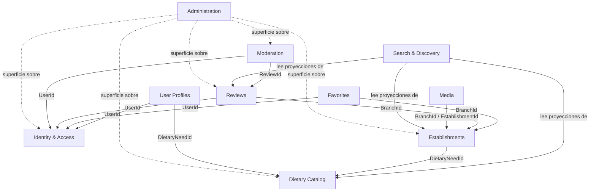

# Contextos delimitados — Lyria

## Introducción

Lyria organiza su dominio en diez contextos delimitados (bounded contexts). Cada contexto es responsable de un conjunto cohesivo de conceptos, posee sus propios datos y establece límites explícitos sobre lo que puede y no puede conocer.

Los nombres técnicos de módulos, entidades y relaciones se mantienen en inglés. La comunicación entre contextos se realiza a través de identificadores compartidos (UserId, BranchId, etc.) y nunca mediante referencias directas a entidades de otro contexto.

---

## Mapa de contextos

El siguiente diagrama muestra las relaciones y dependencias entre los diez módulos. Las flechas indican de quién consume datos o a quién consulta cada contexto.

> Las líneas punteadas de **Administration** indican que no es un dominio independiente, sino una superficie de aplicación que orquesta funcionalidades de otros contextos.

---

## Resumen de módulos

| Módulo | Responsabilidad principal | Dependencias permitidas | Datos prohibidos |
|--------|--------------------------|------------------------|-----------------|
| Identity & Access | Autenticación, autorización, roles y permisos | Ninguno | Nombre personal, preferencias alimentarias, favoritos, reseñas |
| User Profiles | Perfil personal, preferencias alimentarias | Identity & Access (UserId), Dietary Catalog (DietaryNeedId) | Contraseñas, credenciales, roles |
| Establishments | Establecimientos, sedes, datos comerciales | Dietary Catalog (DietaryNeedId) | Usuarios, reseñas, favoritos, imágenes binarias |
| Dietary Catalog | Necesidades alimentarias, niveles de adecuación | Ninguno | Establecimientos, usuarios, reseñas |
| Search & Discovery | Búsqueda, filtros, proyecciones de lectura | Proyecciones de lectura de Establishments, Dietary Catalog y Reviews (via contratos estables, no acceso directo a agregados) | Escritura en cualquier otro contexto, acceso a datos privados de User Profiles, acceso directo a agregados internos de otros módulos |
| Favorites | Marcado de sedes como favoritas por usuario | Identity & Access (UserId), Establishments (BranchId) | Detalles del perfil, datos del establecimiento |
| Reviews | Valoraciones y comentarios sobre sedes | Identity & Access (UserId), Establishments (BranchId) | Contraseñas, favoritos, datos comerciales |
| Media | Metadatos de imágenes, orden y estado de publicación | Establishments (BranchId / EstablishmentId) | Binarios en SQL Server, datos de usuario |
| Moderation | Reportes, revisión y resolución de contenido | Identity & Access (UserId), Reviews (ReviewId) | Datos de perfil, contraseñas, datos comerciales |
| Administration | Superficie de aplicación sobre otros módulos | Todos los módulos (solo lectura o invocación de comandos) | Lógica de dominio propia |

---

## Detalle por módulo

### 1. Identity & Access

Gestiona la identidad de acceso al sistema: quién puede entrar, con qué credenciales y qué está autorizado a hacer.

**Entidades y conceptos propios**

| Concepto | Nombre técnico |
|----------|---------------|
| Cuenta de usuario | `UserAccount` |
| Correo electrónico | `Email` |
| Credenciales | `Credentials` |
| Estado de acceso | `AccountStatus` |
| Verificación de correo | `EmailVerification` |
| Rol | `Role` |
| Permiso | `Permission` |
| Asignación de rol | `RoleAssignment` |
| Alcance de autorización | `RoleScope` |
| Sesiones y tokens (futuro) | `Session`, `RefreshToken` |

**Dependencias permitidas**

Ninguna. Este contexto no depende de ningún otro módulo del sistema.

**Datos prohibidos**

- Nombre personal, apellido, teléfono, foto de perfil
- Fecha de nacimiento
- Preferencias o necesidades alimentarias
- Establecimientos o sedes favoritas
- Reseñas o valoraciones

---

### 2. User Profiles

Gestiona la información personal del usuario y sus preferencias alimentarias declaradas.

**Entidades y conceptos propios**

| Concepto | Nombre técnico |
|----------|---------------|
| Perfil de usuario | `UserProfile` |
| Nombre | `FirstName` |
| Apellido | `LastName` |
| Teléfono | `PhoneNumber` |
| Fecha de nacimiento | `DateOfBirth` |
| Foto de perfil | `ProfilePhoto` |
| Necesidades alimentarias del usuario | `UserDietaryNeed` |
| Preferencias personales | `PersonalPreferences` |

**Relación con Identity & Access**

Este contexto conoce al usuario únicamente a través de `UserId`, que actúa como clave foránea lógica hacia Identity & Access. No duplica ni almacena credenciales.

**Dependencias permitidas**

- Identity & Access: `UserId` (referencia de identidad)
- Dietary Catalog: `DietaryNeedId` (referencia al catálogo de necesidades)

**Datos prohibidos**

- Contraseñas o credenciales de cualquier tipo
- Roles o permisos
- Estado de la cuenta (`AccountStatus`)
- Tokens de acceso o sesiones

---

### 3. Establishments

Gestiona los establecimientos gastronómicos y sus sedes físicas, incluyendo todos los datos comerciales y operativos.

**Entidades y conceptos propios**

| Concepto | Nombre técnico |
|----------|---------------|
| Establecimiento | `Establishment` |
| Sede | `Branch` |
| Categoría | `EstablishmentCategory` |
| Dirección | `Address` |
| Geolocalización | `GeoLocation` |
| Contacto | `ContactInfo` |
| Período de apertura | `BranchOpeningPeriod` |
| Servicio | `Service` |
| Estado de publicación | `PublicationStatus` |
| Estado de verificación | `VerificationStatus` |
| Adecuación alimentaria de sede | `BranchDietarySuitability` |
| Slug | `Slug` |
| Zona horaria | `TimeZoneId` |

**Dependencias permitidas**

- Dietary Catalog: `DietaryNeedId` (para registrar la adecuación alimentaria de cada sede)

**Datos prohibidos**

- Información de usuarios (perfiles, contraseñas, roles)
- Reseñas o valoraciones
- Favoritos
- Binarios de imágenes (solo metadatos de media pertenecen a Media)

---

### 4. Dietary Catalog

Mantiene el catálogo centralizado y autoritativo de todas las necesidades alimentarias que el sistema reconoce.

**Entidades y conceptos propios**

| Concepto | Nombre técnico |
|----------|---------------|
| Necesidad alimentaria | `DietaryNeed` |
| Restricción médica | `MedicalRestriction` |
| Alergia | `Allergy` |
| Intolerancia | `Intolerance` |
| Estilo de vida | `Lifestyle` |
| Requerimiento religioso/cultural | `Religious` |
| Preferencia | `Preference` |
| Nivel de adecuación | `SuitabilityLevel` |
| Fuente de información | `InformationSource` |
| Estado de verificación | `VerificationStatus` |
| Certificación (futuro) | `DietaryCertification` |

**Dependencias permitidas**

Ninguna. Este contexto es una fuente de verdad autónoma que otros módulos consultan mediante identificadores.

**Datos prohibidos**

- Establecimientos o sedes
- Usuarios o perfiles
- Reseñas o valoraciones
- Imágenes

---

### 5. Search & Discovery

Provee capacidades de búsqueda y descubrimiento público de establecimientos y sedes, basadas en proyecciones de lectura optimizadas.

**Responsabilidades**

| Capacidad | Descripción |
|-----------|-------------|
| Búsqueda textual | Por nombre de establecimiento, categoría o descripción |
| Filtros | Por necesidad alimentaria, nivel de adecuación, categoría, servicios |
| Paginación y ordenamiento | Resultados paginados y ordenables por relevancia, rating o distancia |
| Búsqueda por proximidad | Filtro y ordenamiento por distancia a coordenadas dadas |
| Proyecciones de lectura | Vistas desnormalizadas optimizadas para consulta pública |
| Consultas públicas | No requieren autenticación |

**Dependencias permitidas (solo lectura)**

Search & Discovery no depende directamente de los agregados internos de otros módulos ni reutiliza sus entidades de dominio como modelos de consulta. Consume contratos estables mediante proyecciones de lectura propias, actualizadas a partir de eventos publicados por los módulos fuente:

- Establishments: proyección de sedes y establecimientos (datos públicos de nombre, slug, categorías, servicios, adecuación alimentaria, dirección, geolocalización y estado de publicación)
- Dietary Catalog: proyección de necesidades alimentarias (identificadores y nombres para filtros)
- Reviews: proyección del resumen de valoraciones (`ReviewSummary`) con rating promedio y total de reseñas

**Datos prohibidos / restricciones**

- Este contexto NO es propietario de establecimientos, sedes, reseñas ni catálogos.
- No accede directamente a los agregados internos de otros módulos.
- No reutiliza entidades de dominio de otros contextos como modelos de consulta propios.
- No accede a datos privados de perfiles de usuario (`UserProfile`).
- No puede escribir en ningún otro contexto ni modificar datos maestros.
- No almacena estado propio de negocio; solo mantiene proyecciones de lectura derivadas.
- Trabaja con identificadores (`EstablishmentId`, `BranchId`, `DietaryNeedId`) para relacionar conceptos entre proyecciones.

**Proyección conceptual: `EstablishmentSearchDocument`**

> **Nota:** lo siguiente es un concepto de diseño a documentar. No debe implementarse hasta que se defina la estrategia de materialización de proyecciones.

`EstablishmentSearchDocument` es una proyección de solo lectura (NO una entidad, NO un aggregate root) que consolida los datos públicos necesarios para la búsqueda de sedes. Puede incluir:

| Campo | Origen |
|-------|--------|
| `EstablishmentId` | Establishments |
| `BranchId` | Establishments |
| `Name` | Establishments |
| `Slug` | Establishments |
| `Categories` | Establishments |
| `Services` | Establishments |
| `DietarySuitabilities` | Establishments |
| `Address` | Establishments |
| `GeoLocation` | Establishments |
| `PublicationStatus` | Establishments |
| `ReviewSummary` | Reviews |

Esta proyección se materializa y actualiza desde eventos publicados por Establishments y Reviews. No existe en el dominio como aggregate root ni como entidad con comportamiento de escritura.

---

### 6. Favorites

Gestiona la relación entre usuarios y sedes marcadas como favoritas.

**Entidades y conceptos propios**

| Concepto | Nombre técnico |
|----------|---------------|
| Favorito | `Favorite` |
| Referencia al usuario | `UserId` |
| Referencia a la sede | `BranchId` |
| Fecha de marcado | `MarkedAt` |

**Responsabilidades**

- Agregar una sede a favoritos
- Eliminar una sede de favoritos
- Consultar el listado de favoritos de un usuario
- Prevenir duplicados (un usuario no puede marcar la misma sede dos veces)

**Dependencias permitidas**

- Identity & Access: `UserId` (identidad del usuario)
- Establishments: `BranchId` (referencia a la sede)

**Datos prohibidos**

- Detalles del perfil del usuario (nombre, foto, etc.)
- Datos comerciales del establecimiento
- Reseñas o valoraciones

---

### 7. Reviews

Gestiona las valoraciones y comentarios que los usuarios publican sobre las sedes.

**Entidades y conceptos propios**

| Concepto | Nombre técnico |
|----------|---------------|
| Reseña | `Review` |
| Valoración | `Rating` |
| Comentario | `Comment` |
| Autoría | `AuthorId` (UserId) |
| Estado de ciclo de vida | `ReviewStatus` |
| Resumen de reseñas | `ReviewSummary` |

**Responsabilidades**

- Crear, editar y eliminar reseñas (solo por su autor)
- Gestionar el ciclo de vida: borrador, publicado, oculto
- Calcular y mantener el resumen de valoraciones de una sede (`ReviewSummary`)
- Proveer proyecciones de lectura a Search & Discovery

**Dependencias permitidas**

- Identity & Access: `UserId` (autoría)
- Establishments: `BranchId` (sede valorada)

**Datos prohibidos**

- Contraseñas o credenciales
- Favoritos
- Datos comerciales o información de perfil

---

### 8. Media

Gestiona los metadatos de las imágenes asociadas a establecimientos y sedes. No almacena binarios.

**Entidades y conceptos propios**

| Concepto | Nombre técnico | Rol en el dominio |
|----------|---------------|------------------|
| Galería de imágenes de sede | `BranchMediaGallery` | Aggregate root — una galería por sede |
| Imagen de sede | `BranchImage` | Entidad interna de `BranchMediaGallery` |
| Referencia de almacenamiento | `StorageKey` | Clave de acceso al proveedor externo |
| URL pública | `PublicUrl` | Dirección de acceso público a la imagen |
| Nombre de archivo | `FileName` | Nombre original del archivo subido |
| Tipo MIME | `MimeType` | Tipo de imagen (image/jpeg, image/png, image/webp) |
| Texto alternativo | `AlternativeText` | Descripción accesible de la imagen |
| Imagen primaria | `IsPrimary` | Indicador de imagen principal de la galería |
| Orden de visualización | `SortOrder` | Posición de la imagen en la galería |
| Estado de publicación | `PublicationStatus` | Estado del ciclo de vida de la imagen |

**Responsabilidades**

- Mantener la galería de imágenes de cada sede como unidad de consistencia (`BranchMediaGallery`)
- Registrar metadatos de imágenes subidas a almacenamiento externo (ej. Azure Blob Storage, AWS S3)
- Garantizar que en todo momento exista como máximo una imagen marcada como principal por galería
- Gestionar el orden de visualización con índices únicos dentro de la galería
- Controlar el estado de publicación de cada imagen
- Archivar lógicamente imágenes sin eliminarlas físicamente

**Dependencias permitidas**

- Establishments: `BranchId`, `EstablishmentId` (entidad a la que pertenece la imagen)

**Restricciones críticas**

- **Prohibido** almacenar binarios de imagen en SQL Server.
- Los binarios residen exclusivamente en el proveedor de almacenamiento externo.
- Este contexto solo guarda la referencia (`StorageKey`) y los metadatos asociados.

---

### 9. Moderation

Gestiona el proceso de reporte, revisión y resolución de contenido potencialmente inapropiado.

**Entidades y conceptos propios**

| Concepto | Nombre técnico |
|----------|---------------|
| Reporte de contenido | `ContentReport` |
| Estado de revisión | `ModerationStatus` |
| Decisión | `ModerationDecision` |
| Observaciones | `ModerationNotes` |
| Historial de decisiones | `DecisionHistory` |
| Verificación de contenido | `ContentVerification` |

**Responsabilidades**

- Recibir reportes de usuarios sobre reseñas u otro contenido
- Gestionar el flujo de revisión: pendiente, en revisión, aprobado, rechazado
- Registrar las observaciones y decisiones del moderador
- Mantener el historial de decisiones para auditoría

**Dependencias permitidas**

- Identity & Access: `UserId` (identidad del reportante y del moderador)
- Reviews: `ReviewId` (contenido reportado)

**Datos prohibidos**

- Datos de perfil del usuario (nombre, foto, etc.)
- Contraseñas o credenciales
- Datos comerciales de establecimientos

---

### 10. Administration

> **Recomendación arquitectónica**: Administration NO debe implementarse como un dominio independiente con entidades propias.

**Naturaleza del módulo**

Administration es una **superficie de aplicación** (application surface) que orquesta funcionalidades de otros contextos para habilitarlas a usuarios con rol administrativo. No posee lógica de dominio propia.

**Responsabilidades**

- Exponer operaciones administrativas como endpoints HTTP protegidos por rol
- Delegar toda la lógica de negocio a los contextos correspondientes
- Agregar vistas y reportes compuestos a partir de proyecciones de múltiples contextos
- Proporcionar flujos de trabajo de moderación, verificación y gestión de catálogos

**Dependencias permitidas**

Puede invocar comandos y consultas de todos los módulos del sistema.

**Por qué no debe ser un dominio independiente**

Crear entidades de dominio propias en Administration generaría duplicación de conceptos ya definidos en otros contextos (ej. volver a modelar `Establishment` o `Review` con propósitos administrativos). La lógica de aprobación, verificación y moderación ya reside en los contextos que son dueños del dato.

**Implementación recomendada**

Implementar como un conjunto de Controllers en `Lyria.Api` y casos de uso en `Lyria.Application`, agrupados bajo el prefijo `Administration/`, sin crear un proyecto o namespace de dominio separado.

---

## Reglas generales de integración entre contextos

1. **Sin referencias directas a entidades ajenas.** Cada contexto conoce a los demás únicamente a través de identificadores primitivos (`UserId`, `BranchId`, `ReviewId`, etc.).

2. **Sin base de datos compartida entre contextos.** Aunque todos los contextos pueden residir en la misma base de datos SQL Server por practicidad, cada uno es responsable exclusivo de sus tablas.

3. **Proyecciones de lectura para consultas cruzadas.** Search & Discovery mantiene proyecciones desnormalizadas actualizadas, en lugar de hacer joins entre tablas de distintos contextos en tiempo de consulta.

4. **Los límites del contexto se verifican en código.** Los namespaces de `Lyria.Domain` reflejan los contextos (`Identity`, `Profiles`, `Establishments`, `DietaryCatalog`, etc.) y las pruebas arquitectónicas validan que no haya dependencias cruzadas indebidas.
