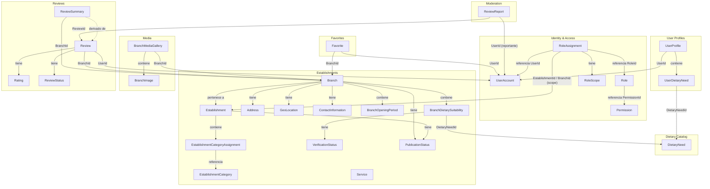

# Modelo conceptual — Lyria

## Introducción

Este documento describe el modelo conceptual del dominio de Lyria, una plataforma gastronómica que conecta usuarios con establecimientos que pueden atender sus necesidades alimentarias.

El modelo conceptual no es un esquema de base de datos. No define tipos SQL, claves foráneas ni tablas. Define qué conceptos existen en el dominio, qué significan, quién los posee, qué responsabilidades tienen y qué restricciones deben respetar.

Los nombres técnicos están en inglés. La documentación, los nombres funcionales y los mensajes al usuario están en español.

---

## Criterios de clasificación

Antes de revisar cada concepto, se establecen los criterios de clasificación utilizados en este documento.

| Tipo | Criterio |
|------|----------|
| **Aggregate root** | Unidad de consistencia transaccional. Posee identidad estable y duradera. Solo se accede a sus miembros internos a través de él. Puede existir de forma independiente. |
| **Entity** | Tiene identidad propia dentro de un agregado, pero su ciclo de vida depende del aggregate root que lo contiene. |
| **Value object** | No tiene identidad propia. Se define únicamente por sus atributos. Es inmutable. Dos instancias con los mismos atributos son equivalentes. |
| **Catalog** | Dato de referencia administrado, raramente modificado. Puede modelarse como aggregate root con comportamiento limitado. |
| **Relationship with behavior** | Asociación entre conceptos de distintos agregados que encapsula reglas o estado propio. Tiene identidad pero solo existe en relación a los extremos que conecta. |
| **Projection** | Dato derivado y desnormalizado calculado a partir de otros conceptos. No tiene comportamiento de escritura propio. |
| **Deferred concept** | Concepto identificado pero cuya complejidad, costo o justificación de negocio no amerita modelarlo en el MVP. Se documenta para no perderlo de vista. |

---

## 1. Identity & Access

### UserAccount

| Atributo | Detalle |
|----------|---------|
| **Nombre funcional** | Cuenta de usuario |
| **Módulo** | Identity & Access |
| **Tipo** | Aggregate root |
| **Identidad conceptual** | La identidad de acceso de una persona al sistema. Representa quién puede entrar, con qué credenciales y en qué estado se encuentra su cuenta. Es distinta del perfil personal del usuario. |
| **Responsabilidad** | Gestionar el ciclo de vida de la cuenta: registro, activación, suspensión y eliminación. Custodiar las credenciales de forma segura (hash de contraseña). Controlar el estado de acceso. |
| **Invariantes principales** | El email es único en todo el sistema. La contraseña nunca se almacena en texto plano. Una cuenta suspendida no puede autenticarse. Una cuenta no verificada tiene acceso limitado. |
| **Dependencias permitidas** | Ninguna. Este agregado no depende de ningún otro módulo. |
| **Decisión MVP** | MVP. Concepto central sin el cual el sistema no funciona. |

**Análisis crítico:** `UserAccount` y `UserProfile` son separaciones correctas y necesarias. La tentación común es unirlos en una sola entidad `User`, pero eso viola la separación de responsabilidades entre autenticación (Identity & Access) y datos personales (User Profiles). Mantenerlos separados también facilita escenarios futuros como autenticación federada (OAuth) sin afectar el perfil.

---

### Role

| Atributo | Detalle |
|----------|---------|
| **Nombre funcional** | Rol |
| **Módulo** | Identity & Access |
| **Tipo** | Aggregate root |
| **Identidad conceptual** | Un conjunto nombrado de permisos que puede asignarse a un usuario. Los roles son definidos por administradores del sistema, no por los usuarios finales. |
| **Responsabilidad** | Agrupar referencias a permisos bajo un nombre funcional. Permitir agregar y revocar `PermissionId` del conjunto controlado. Prevenir duplicados en la colección de permisos. |
| **Invariantes principales** | El código del rol es único. Un rol debe tener al menos un permiso para ser asignable. No puede contener el mismo `PermissionId` dos veces. Los roles del sistema (ej. `SystemAdmin`) no pueden eliminarse ni modificarse desde la API pública. |
| **Dependencias permitidas** | Ninguna externa al módulo. Mantiene un conjunto controlado de `PermissionId` como referencias. No crea ni elimina el catálogo de `Permission`. |
| **Decisión MVP** | MVP. Necesario para diferenciar administradores de usuarios regulares y dueños de establecimientos. |

---

### Permission

| Atributo | Detalle |
|----------|---------|
| **Nombre funcional** | Permiso |
| **Módulo** | Identity & Access |
| **Tipo** | Entidad de referencia independiente con identidad propia |
| **Identidad conceptual** | Una capacidad atómica de realizar una acción específica en el sistema. Se identifica por un código único como `establishments.publish` o `reviews.moderate`. Puede ser asignado a múltiples roles simultáneamente. |
| **Responsabilidad** | Representar una acción autorizable. Ser el átomo del sistema de autorización. Servir como dato de referencia que los roles consultan por `PermissionId`. |
| **Invariantes principales** | El código del permiso es único en el sistema. Los permisos no se crean dinámicamente en tiempo de ejecución: son definidos en el código o en seed de datos. Un permiso puede estar referenciado por múltiples roles sin que ninguno lo posea exclusivamente. |
| **Dependencias permitidas** | Ninguna. |
| **Decisión MVP** | MVP. |

**Análisis crítico:** `Permission` tiene identidad propia e independiente: su código es único en todo el sistema y puede ser referenciado por múltiples roles. No es una entidad interna de `Role`; es una entidad de referencia cuya administración está controlada (se define en código o seed). `Role` no contiene objetos `Permission`; mantiene un conjunto de `PermissionId` que apuntan a permisos existentes en el catálogo. Esto evita la inconsistencia de que cada rol deba duplicar la definición de los mismos permisos.

---

### RolePermission

| Atributo | Detalle |
|----------|---------|
| **Nombre funcional** | Permiso en rol |
| **Módulo** | Identity & Access |
| **Tipo** | Representación conceptual de una asociación |
| **Identidad conceptual** | La asociación entre un rol y un permiso, que indica que ese rol otorga esa capacidad. |
| **Responsabilidad** | Registrar qué `PermissionId` tiene asociado un rol. |
| **Invariantes principales** | Un permiso no puede asignarse dos veces al mismo rol. |
| **Dependencias permitidas** | Interno al agregado `Role` como parte del conjunto controlado de `PermissionId`. |
| **Decisión MVP** | MVP. |

**Análisis crítico:** `RolePermission` es una representación conceptual de la asociación entre `Role` y `Permission`. Puede convertirse en una tabla de persistencia (ej. `RolePermissions` en la base de datos), pero no debe declararse como aggregate root independiente ni tratarse como una entidad compartida entre módulos. En el dominio, se materializa como el conjunto de `PermissionId` que `Role` mantiene internamente. `Role` es responsable de agregar y eliminar estas referencias; no existe un aggregate root `RolePermission` separado.

---

### RoleAssignment

| Atributo | Detalle |
|----------|---------|
| **Nombre funcional** | Asignación de rol |
| **Módulo** | Identity & Access |
| **Tipo** | Aggregate root |
| **Identidad conceptual** | La vinculación de un rol a un usuario en un alcance determinado. Una misma persona puede tener el rol `EstablishmentOwner` para un establecimiento específico y el rol `BranchManager` para una sede concreta. |
| **Responsabilidad** | Registrar qué rol tiene un usuario, en qué alcance y desde cuándo. Permitir verificar si una asignación es válida (no expirada, no revocada). Gestionar su propio ciclo de vida independientemente de `UserAccount`. |
| **Invariantes principales** | Un usuario no puede tener el mismo rol asignado dos veces en el mismo alcance. Una asignación revocada no puede usarse para autorización. El alcance `Global` no lleva referencia a establecimiento ni sede. El alcance `Establishment` requiere un `EstablishmentId`. El alcance `Branch` requiere un `BranchId`. |
| **Dependencias permitidas** | Aggregate root independiente dentro del módulo Identity & Access. Referencia `UserId`, `RoleId` y opcionalmente `EstablishmentId` o `BranchId` como identificadores primitivos. |
| **Decisión MVP** | MVP. Necesario para gestionar dueños de establecimientos y administradores. |

---

### RoleScope

| Atributo | Detalle |
|----------|---------|
| **Nombre funcional** | Alcance de rol |
| **Módulo** | Identity & Access |
| **Tipo** | Value object |
| **Identidad conceptual** | El ámbito en que aplica una asignación de rol. Define si el rol otorga permisos globalmente, sobre un establecimiento específico o sobre una sede específica. |
| **Responsabilidad** | Encapsular el tipo de alcance y, cuando corresponde, el identificador de la entidad sobre la que aplica. |
| **Invariantes principales** | Si el tipo es `Global`, no debe haber referencia a establecimiento ni sede. Si el tipo es `Establishment`, debe haber un `EstablishmentId` válido. Si el tipo es `Branch`, debe haber un `BranchId` válido. |
| **Dependencias permitidas** | Ninguna. Usa identificadores primitivos, no referencias a objetos de otros módulos. |
| **Decisión MVP** | MVP. |

---

## 2. User Profiles

### UserProfile

| Atributo | Detalle |
|----------|---------|
| **Nombre funcional** | Perfil de usuario |
| **Módulo** | User Profiles |
| **Tipo** | Aggregate root |
| **Identidad conceptual** | La información personal y las preferencias alimentarias de un usuario. Se identifica por el mismo `UserId` que la cuenta, pero pertenece a un módulo distinto. |
| **Responsabilidad** | Almacenar nombre, apellido, teléfono, foto y fecha de nacimiento del usuario. Registrar las necesidades alimentarias que el usuario declara tener. |
| **Invariantes principales** | El `UserId` referenciado debe corresponder a una cuenta existente en Identity & Access (integridad referencial lógica, no verificada en el agregado). Al menos el nombre o apellido deben estar presentes. Un usuario no puede declarar la misma necesidad alimentaria dos veces. |
| **Dependencias permitidas** | Identity & Access: `UserId` (identificador de referencia). Dietary Catalog: `DietaryNeedId` (identificador de referencia). |
| **Decisión MVP** | MVP. Necesario para personalización y para que los usuarios declaren sus necesidades alimentarias. |

---

### UserDietaryNeed

| Atributo | Detalle |
|----------|---------|
| **Nombre funcional** | Necesidad alimentaria del usuario |
| **Módulo** | User Profiles |
| **Tipo** | Relationship with behavior (dentro del agregado `UserProfile`) |
| **Identidad conceptual** | La declaración de que un usuario tiene una necesidad alimentaria específica. No es un simple tag; puede tener metadata adicional como la severidad o la fecha de declaración. |
| **Responsabilidad** | Registrar qué necesidades alimentarias declara tener un usuario. Permitir agregar y eliminar necesidades del perfil. |
| **Invariantes principales** | No se permiten duplicados: un usuario no puede declarar la misma `DietaryNeedId` dos veces. Solo se puede referenciar `DietaryNeedId` de necesidades activas en el catálogo. |
| **Dependencias permitidas** | Interno a `UserProfile`. Referencia `DietaryNeedId` como identificador primitivo. |
| **Decisión MVP** | MVP. Es la base de la personalización de Lyria. |

---

## 3. Dietary Catalog

### DietaryNeed

| Atributo | Detalle |
|----------|---------|
| **Nombre funcional** | Necesidad alimentaria |
| **Módulo** | Dietary Catalog |
| **Tipo** | Catalog / Aggregate root |
| **Identidad conceptual** | Una condición, restricción, alergia, intolerancia, estilo de vida o requerimiento religioso relacionado con la alimentación. Es el concepto central del diferenciador de Lyria. |
| **Responsabilidad** | Mantener el catálogo autoritativo de todas las necesidades alimentarias que el sistema reconoce. Permitir activar, inactivar y clasificar necesidades por tipo. |
| **Invariantes principales** | El nombre de la necesidad es único. El tipo debe pertenecer al conjunto cerrado: `MedicalRestriction`, `Allergy`, `Intolerance`, `Lifestyle`, `Religious`, `Preference`. Una necesidad inactiva no puede usarse en nuevas asociaciones. |
| **Dependencias permitidas** | Ninguna. Es una fuente de verdad autónoma. |
| **Decisión MVP** | MVP. Con seed de datos inicial para los tipos más comunes. |

---

## 4. Establishments

### EstablishmentCategory

| Atributo | Detalle |
|----------|---------|
| **Nombre funcional** | Categoría de establecimiento |
| **Módulo** | Establishments |
| **Tipo** | Catalog / Aggregate root |
| **Identidad conceptual** | El tipo de establecimiento gastronómico: restaurante, cafetería, bar, panadería, heladería, etc. |
| **Responsabilidad** | Proveer el conjunto de categorías válidas para clasificar establecimientos. Permitir activar e inactivar categorías. |
| **Invariantes principales** | El nombre de la categoría es único. Una categoría inactivada no puede asignarse a nuevos establecimientos, pero las asignaciones existentes se mantienen hasta que el dueño las cambie. |
| **Dependencias permitidas** | Ninguna. |
| **Decisión MVP** | MVP. Un catálogo con seed de datos inicial. |

**Análisis crítico:** `EstablishmentCategory` pertenece al módulo Establishments, ya que es el único consumidor de este catálogo y su administración está vinculada al ciclo de vida de los establecimientos. Si en el futuro Search & Discovery la necesita para filtros, puede acceder a ella mediante proyecciones de lectura sin cambiar el módulo dueño.

---

### Service

| Atributo | Detalle |
|----------|---------|
| **Nombre funcional** | Servicio |
| **Módulo** | Establishments |
| **Tipo** | Catalog / Aggregate root |
| **Identidad conceptual** | Una característica o servicio ofrecido por una sede: delivery, terraza, estacionamiento, WiFi, acceso para personas con movilidad reducida, reservas, etc. |
| **Responsabilidad** | Mantener el catálogo de servicios disponibles para que las sedes los declaren. |
| **Invariantes principales** | El nombre del servicio es único. Un servicio inactivo no puede asignarse a nuevas sedes. |
| **Dependencias permitidas** | Ninguna. |
| **Decisión MVP** | MVP. Con seed de datos inicial. |

**Análisis crítico:** `Service` es conceptualmente idéntico en estructura a `EstablishmentCategory`: ambos son catálogos administrados usados exclusivamente por Establishments. Por ahora, mantenerlos como aggregate roots simples dentro de Establishments es adecuado.

---

### Establishment

| Atributo | Detalle |
|----------|---------|
| **Nombre funcional** | Establecimiento |
| **Módulo** | Establishments |
| **Tipo** | Aggregate root |
| **Identidad conceptual** | La identidad comercial de un negocio gastronómico: su marca, descripción, categorías y presencia web. No es una ubicación física. Un establecimiento puede tener cero o muchas sedes. |
| **Responsabilidad** | Gestionar los datos comerciales del establecimiento. Controlar el estado de publicación. Administrar las categorías asignadas y cuál es la principal. |
| **Invariantes principales** | El slug es único en todo el sistema y no puede estar vacío. Debe tener al menos una categoría asignada para poder publicarse. Solo puede haber una categoría marcada como principal. Un establecimiento archivado no puede publicarse nuevamente sin revisión. |
| **Dependencias permitidas** | Dietary Catalog: indirectamente, a través de sus sedes. No referencia directamente `DietaryNeed` desde `Establishment`. |
| **Decisión MVP** | MVP. |

---

### EstablishmentCategoryAssignment

| Atributo | Detalle |
|----------|---------|
| **Nombre funcional** | Categoría del establecimiento |
| **Módulo** | Establishments |
| **Tipo** | Entity (dentro del agregado `Establishment`) |
| **Identidad conceptual** | La asignación de una categoría específica a un establecimiento, con la indicación de si es la categoría principal. |
| **Responsabilidad** | Registrar qué categorías tiene un establecimiento y cuál es su categoría principal. |
| **Invariantes principales** | Un establecimiento no puede tener la misma categoría asignada dos veces. Solo puede existir una asignación marcada como principal por establecimiento. |
| **Dependencias permitidas** | Interno a `Establishment`. Referencia `EstablishmentCategoryId` como identificador primitivo. |
| **Decisión MVP** | MVP. |

**Análisis crítico:** `EstablishmentCategoryAssignment` no necesita ser un concepto de dominio con nombre propio explícito en el código si su única razón de existir es la colección `Categories` dentro de `Establishment`. Sin embargo, dado que lleva el atributo `IsPrimary`, tiene estado propio y merece ser una entity nombrada. El nombre `EstablishmentCategoryAssignment` es técnicamente correcto pero algo verboso; en el código podría usarse `CategoryAssignment` dentro del namespace `Establishments`.

---

### Branch

| Atributo | Detalle |
|----------|---------|
| **Nombre funcional** | Sede |
| **Módulo** | Establishments |
| **Tipo** | Aggregate root |
| **Identidad conceptual** | Una ubicación física concreta donde un establecimiento atiende al público. Es la unidad operativa fundamental de Lyria: las reseñas, imágenes, servicios, horarios y adecuación alimentaria pertenecen a la sede, no al establecimiento. |
| **Responsabilidad** | Gestionar todos los datos operativos de una ubicación: dirección, geolocalización, contacto, zona horaria, horarios de atención, servicios y adecuación alimentaria. Controlar el estado de publicación. |
| **Invariantes principales** | Toda sede debe pertenecer a un `Establishment`. Una sede no puede publicarse sin dirección, al menos un período de apertura y el establecimiento al que pertenece también publicado. La zona horaria debe ser un identificador IANA válido. Una sede suspendida no es visible en búsquedas. |
| **Dependencias permitidas** | Establishments: referencia a `EstablishmentId` (identificador del establecimiento dueño). Dietary Catalog: `DietaryNeedId` (para adecuación alimentaria). |
| **Decisión MVP** | MVP. |

---

### Address

| Atributo | Detalle |
|----------|---------|
| **Nombre funcional** | Dirección |
| **Módulo** | Establishments |
| **Tipo** | Value object |
| **Identidad conceptual** | La ubicación textual de una sede. Se define por sus atributos: calle, barrio, ciudad, provincia y país. Dos sedes con exactamente los mismos datos de dirección tienen el mismo value object, aunque sean sedes distintas. |
| **Responsabilidad** | Representar y validar la dirección de una sede. |
| **Invariantes principales** | La calle y la ciudad son obligatorias. El país debe ser un código ISO 3166-1 alpha-2 válido. |
| **Dependencias permitidas** | Ninguna. |
| **Decisión MVP** | MVP. |

---

### GeoLocation

| Atributo | Detalle |
|----------|---------|
| **Nombre funcional** | Geolocalización |
| **Módulo** | Establishments |
| **Tipo** | Value object |
| **Identidad conceptual** | Las coordenadas geográficas de una sede. Se define por latitud y longitud. |
| **Responsabilidad** | Representar y validar las coordenadas de una sede. Proveer métodos de comparación y distancia si son necesarios. |
| **Invariantes principales** | La latitud debe estar entre -90 y 90. La longitud debe estar entre -180 y 180. |
| **Dependencias permitidas** | Ninguna. |
| **Decisión MVP** | MVP. Necesario para búsqueda por proximidad. |

---

### ContactInformation

| Atributo | Detalle |
|----------|---------|
| **Nombre funcional** | Información de contacto |
| **Módulo** | Establishments |
| **Tipo** | Value object |
| **Identidad conceptual** | Los datos de contacto de una sede: teléfono y número de WhatsApp. |
| **Responsabilidad** | Agrupar los datos de contacto en un objeto inmutable con validación. |
| **Invariantes principales** | Al menos uno de los dos campos debe estar presente si se declara el objeto. Los números deben tener formato E.164 o equivalente validable. |
| **Dependencias permitidas** | Ninguna. |
| **Decisión MVP** | MVP. |

**Análisis crítico:** `ContactInformation` podría simplificarse a campos sueltos en `Branch` si no se prevé reutilizarlo. Sin embargo, agruparlo como value object es correcto porque el conjunto tiene coherencia semántica (datos de contacto) y puede validarse como unidad.

---

### BranchService

| Atributo | Detalle |
|----------|---------|
| **Nombre funcional** | Servicio de la sede |
| **Módulo** | Establishments |
| **Tipo** | Relationship (dentro del agregado `Branch`) |
| **Identidad conceptual** | La declaración de que una sede ofrece un servicio específico del catálogo. |
| **Responsabilidad** | Registrar qué servicios tiene disponibles una sede. |
| **Invariantes principales** | Una sede no puede declarar el mismo servicio dos veces. Solo se pueden referenciar servicios activos en el catálogo. |
| **Dependencias permitidas** | Interno a `Branch`. Referencia `ServiceId` como identificador primitivo. |
| **Decisión MVP** | MVP. |

**Análisis crítico:** Al igual que `RolePermission`, `BranchService` es conceptualmente la colección `Services` dentro de `Branch`. No necesita un nombre de clase propio en el dominio a menos que tenga atributos adicionales más allá de los identificadores. Si solo registra `BranchId + ServiceId`, puede ser una simple colección de `ServiceId` dentro de `Branch`. **Recomendación: no modelar como clase independiente; representar como colección dentro de `Branch`.**

---

### BranchOpeningPeriod

| Atributo | Detalle |
|----------|---------|
| **Nombre funcional** | Período de apertura |
| **Módulo** | Establishments |
| **Tipo** | Entity (dentro del agregado `Branch`) |
| **Identidad conceptual** | El intervalo de atención de una sede en un día específico de la semana. Una sede puede tener varios períodos por día (ej. mediodía y noche). |
| **Responsabilidad** | Registrar los horarios de apertura y cierre de una sede para cada día. |
| **Invariantes principales** | El día debe ser un valor del enum `DayOfWeek`. La hora de cierre debe ser posterior a la hora de apertura (o representar apertura pasada medianoche con convención acordada). No puede haber períodos solapados para el mismo día en la misma sede. |
| **Dependencias permitidas** | Interno a `Branch`. |
| **Decisión MVP** | MVP. |

**Análisis crítico:** La clasificación entre entity y value object aquí es genuinamente ambigua. Si los períodos se identifican solo por su posición en la colección (sin ID propio), son value objects. Si necesitan ser reemplazados individualmente (ej. "cambia el horario del lunes"), necesitan identidad propia y son entities. Para Lyria, donde los horarios se editan individualmente, se recomienda **entity** con identidad propia.

---

### BranchDietarySuitability

| Atributo | Detalle |
|----------|---------|
| **Nombre funcional** | Adecuación alimentaria de la sede |
| **Módulo** | Establishments |
| **Tipo** | Entity with behavior (dentro del agregado `Branch`) |
| **Identidad conceptual** | La relación entre una sede y una necesidad alimentaria, con nivel de adecuación, fuente de información, estado de verificación, notas y evidencias. Es el concepto más rico y diferenciador de Lyria. |
| **Responsabilidad** | Registrar en qué grado una sede puede atender una necesidad alimentaria. Gestionar el proceso de verificación: quién verificó, cuándo, con qué evidencia y cuándo expira. Permitir actualizar el nivel de adecuación y las notas. |
| **Invariantes principales** | Una sede no puede tener la misma `DietaryNeedId` registrada dos veces. El estado de verificación `Verified` requiere un `VerifierId` y una fecha de verificación. El estado `Expired` se alcanza cuando la fecha de expiración es superada. Una adecuación con fuente `UserReported` no puede tener estado `Verified` sin pasar por revisión. |
| **Dependencias permitidas** | Interno a `Branch`. Referencia `DietaryNeedId` como identificador primitivo. Referencia `VerifierId` (UserId) como identificador primitivo para el verificador. |
| **Decisión MVP** | MVP parcial. Las funcionalidades básicas (registrar nivel y fuente) son MVP. La verificación formal con evidencia y expiración puede diferirse a post-MVP. |

---

## 5. Media

### BranchMediaGallery

| Atributo | Detalle |
|----------|---------|
| **Nombre funcional** | Galería de imágenes de sede |
| **Módulo** | Media |
| **Tipo** | Aggregate root |
| **Identidad conceptual** | El agregado que gestiona la colección de imágenes de una sede. Existe exactamente una galería por sede, identificada por `BranchId`. No almacena binarios; solo metadatos y referencias al proveedor de almacenamiento externo. |
| **Responsabilidad** | Gestionar la colección de imágenes de una sede: agregar imágenes, eliminarlas, designar la imagen principal y reordenar la galería. Controlar el estado de publicación de la galería. Garantizar que en todo momento haya como máximo una imagen activa marcada como principal y que los órdenes de clasificación sean únicos. |
| **Invariantes principales** | Solo puede existir una imagen marcada como `IsPrimary` dentro de la galería en un momento dado. Los valores de `SortOrder` deben ser únicos dentro de la colección. La galería pertenece a exactamente una sede (`BranchId`). |
| **Dependencias permitidas** | Establishments: `BranchId` (sede a la que pertenece la galería). |
| **Decisión MVP** | MVP. |

**Análisis crítico:** `BranchMediaGallery` es la unidad de consistencia transaccional del módulo Media. Agrupa las imágenes de una sede como entidades internas y garantiza sus invariantes colectivas: unicidad de imagen principal y unicidad de órdenes de clasificación. Al ser el aggregate root, es el único punto de acceso a las imágenes de la sede desde el dominio.

---

### BranchImage

| Atributo | Detalle |
|----------|---------|
| **Nombre funcional** | Imagen de sede |
| **Módulo** | Media |
| **Tipo** | Entity (dentro del agregado `BranchMediaGallery`) |
| **Identidad conceptual** | Los metadatos de una imagen dentro de la galería de una sede. El binario no reside en el sistema; solo se almacena la referencia (`StorageKey`) al proveedor externo (Azure Blob Storage, AWS S3, etc.). |
| **Responsabilidad** | Mantener los metadatos de una imagen: referencia de almacenamiento, URL pública, nombre de archivo, tipo MIME, texto alternativo, indicador de imagen principal, orden de visualización, estado y marcas de auditoría. |
| **Atributos principales** | `BranchImageId`, `StorageKey`, `PublicUrl`, `FileName`, `MimeType`, `AlternativeText`, `IsPrimary`, `SortOrder`, `Status`, `CreatedAt`, `UpdatedAt`. |
| **Invariantes principales** | El `StorageKey` no puede estar vacío. El `MimeType` debe ser un tipo de imagen válido (image/jpeg, image/png, image/webp). Las transiciones de `IsPrimary` y `SortOrder` son controladas por `BranchMediaGallery`, no por la entidad directamente. |
| **Dependencias permitidas** | Interno a `BranchMediaGallery`. |
| **Decisión MVP** | MVP. |

**Análisis crítico:** `BranchImage` tiene identidad propia (`BranchImageId`) dentro del agregado, lo que permite referenciarla para operaciones como designar imagen principal o eliminar una imagen específica. Sin embargo, no es un aggregate root: su ciclo de vida está completamente gobernado por `BranchMediaGallery`, que protege las invariantes colectivas de la galería.

---

## 6. Reviews

### Review

| Atributo | Detalle |
|----------|---------|
| **Nombre funcional** | Reseña |
| **Módulo** | Reviews |
| **Tipo** | Aggregate root |
| **Identidad conceptual** | La valoración y comentario que un usuario publica sobre una sede específica. Tiene un ciclo de vida propio y puede ser moderada, ocultada o eliminada. |
| **Responsabilidad** | Capturar la experiencia de un usuario en una sede. Gestionar el ciclo de vida de la reseña: creación, edición, publicación, moderación y eliminación. |
| **Invariantes principales** | Un usuario solo puede tener una reseña publicada o pendiente por sede (no puede publicar dos reseñas sobre la misma sede simultáneamente). El rating debe ser un entero entre 1 y 5. Una reseña eliminada por el autor no puede restaurarse. Una reseña `Rejected` por moderación no puede publicarse nuevamente sin revisión. |
| **Dependencias permitidas** | Identity & Access: `UserId` (autor). Establishments: `BranchId` (sede valorada). |
| **Decisión MVP** | MVP. |

---

### Rating

| Atributo | Detalle |
|----------|---------|
| **Nombre funcional** | Valoración |
| **Módulo** | Reviews |
| **Tipo** | Value object |
| **Identidad conceptual** | La puntuación numérica de una reseña, expresada como un entero del 1 al 5. Se define completamente por su valor. |
| **Responsabilidad** | Representar y validar la puntuación de una reseña. |
| **Invariantes principales** | El valor debe ser un entero entre 1 y 5, ambos inclusive. |
| **Dependencias permitidas** | Ninguna. |
| **Decisión MVP** | MVP. |

**Análisis crítico:** `Rating` como value object es correcto. Dos reseñas con rating 4 tienen el mismo valor de `Rating(4)`. No tiene identidad propia. La decisión de usar entero vs decimal es de dominio: Lyria usa enteros del 1 al 5, lo cual es estándar en plataformas de reseñas gastronómicas y simplifica el cálculo del promedio y la comprensión por parte del usuario.

---

### ReviewStatus

| Atributo | Detalle |
|----------|---------|
| **Nombre funcional** | Estado de la reseña |
| **Módulo** | Reviews |
| **Tipo** | Value object / enum |
| **Identidad conceptual** | El estado del ciclo de vida de una reseña: pendiente de moderación, publicada, rechazada, oculta o eliminada por el autor. |
| **Responsabilidad** | Representar el estado actual de una reseña. Ser el eje de las reglas de transición de estado del agregado `Review`. |
| **Valores** | `Pending`, `Published`, `Rejected`, `Hidden`, `DeletedByAuthor` |
| **Invariantes principales** | Las transiciones de estado son unidireccionales o acotadas: una reseña `DeletedByAuthor` no puede volver a ningún otro estado. `Rejected` solo puede ser establecido por un moderador. |
| **Dependencias permitidas** | Ninguna. |
| **Decisión MVP** | MVP. |

---

### ReviewSummary

| Atributo | Detalle |
|----------|---------|
| **Nombre funcional** | Resumen de reseñas |
| **Módulo** | Reviews |
| **Tipo** | Projection |
| **Identidad conceptual** | Un dato derivado que agrega el rating promedio y el total de reseñas publicadas de una sede. No tiene comportamiento de escritura propio. Se calcula a partir del conjunto de reseñas publicadas. |
| **Responsabilidad** | Proveer una vista rápida y desnormalizada del estado de valoraciones de una sede, para ser consumida por Search & Discovery y por la ficha pública de la sede. |
| **Invariantes principales** | Es un dato de solo lectura. Se recalcula o actualiza cuando se publica, oculta o elimina una reseña. El promedio se calcula solo sobre reseñas con estado `Published`. |
| **Dependencias permitidas** | Derivado de `Review`. Asociado a un `BranchId`. |
| **Decisión MVP** | MVP. Puede implementarse como dato mantenido en la tabla de reseñas o como vista materializada. |

**Análisis crítico:** `ReviewSummary` no debe modelarse como aggregate root ni como entity. Es puro dato derivado. La pregunta de implementación (¿campo desnormalizado en Branch? ¿tabla separada? ¿calculado on-demand?) es de infraestructura, no de dominio. En el modelo conceptual, `ReviewSummary` es una proyección que existe por conveniencia de lectura.

---

## 7. Moderation

### ReviewReport

| Atributo | Detalle |
|----------|---------|
| **Nombre funcional** | Reporte de reseña |
| **Módulo** | Moderation |
| **Tipo** | Aggregate root |
| **Identidad conceptual** | El reporte que un usuario hace sobre una reseña que considera inapropiada. Tiene su propio ciclo de vida: desde el reporte inicial hasta la resolución por un moderador. |
| **Responsabilidad** | Registrar el reporte, el motivo y los detalles aportados por el usuario. Gestionar el flujo de revisión: pendiente, en revisión, aprobado, rechazado. Registrar la decisión del moderador y las notas. |
| **Invariantes principales** | Un usuario no puede reportar la misma reseña dos veces con el mismo motivo. El moderador que resuelve el reporte no debe ser el mismo que creó la reseña reportada. Un reporte resuelto no puede volver a estado pendiente. El código de motivo debe pertenecer al conjunto predefinido de razones de reporte. |
| **Dependencias permitidas** | Reviews: `ReviewId` (contenido reportado). Identity & Access: `UserId` (reportante y moderador). |
| **Decisión MVP** | MVP básico. La resolución simple (aprobar/rechazar) es MVP. Flujos de escalada o apelación son post-MVP. |

**Análisis crítico:** La clasificación como aggregate root se justifica porque `ReviewReport` tiene identidad propia, ciclo de vida independiente y puede ser accedido directamente por moderadores. No es una simple colección dentro de `Review` porque pertenece a un módulo diferente (Moderation) y `Review` no debería conocer sus reportes.

---

### ModerationDecision

| Atributo | Detalle |
|----------|---------|
| **Nombre funcional** | Decisión de moderación |
| **Módulo** | Moderation |
| **Tipo** | Concepto diferido |
| **Identidad conceptual** | La decisión formal de un moderador sobre un reporte, con justificación, historial de decisiones previas y posibilidad de apelación. |
| **Responsabilidad** | Registrar formalmente la decisión de moderación con trazabilidad completa. |
| **Decisión MVP** | Post-MVP. En el MVP, la decisión se registra como atributos simples dentro de `ReviewReport` (estado de resolución y notas del moderador). `ModerationDecision` como objeto propio con historial y apelación se justifica cuando el volumen de moderación y los requisitos legales lo demanden. |

**Análisis crítico:** Separar `ModerationDecision` como concepto independiente agrega complejidad sin beneficio claro en el MVP. El estado de resolución y las notas pueden ser atributos de `ReviewReport`. Si en el futuro se requiere historial de decisiones, múltiples moderadores o apelaciones, entonces `ModerationDecision` merece su propio aggregate root o entity. **Recomendación: diferir.**

---

### VerificationStatus

| Atributo | Detalle |
|----------|---------|
| **Nombre funcional** | Estado de verificación |
| **Módulo** | Establishments (donde se usa en `BranchDietarySuitability`) |
| **Tipo** | Value object / enum |
| **Identidad conceptual** | El estado del proceso de verificación de la adecuación alimentaria de una sede. |
| **Valores** | `Unverified`, `Pending`, `Verified`, `Rejected`, `Expired` |
| **Responsabilidad** | Representar el estado actual del proceso de verificación. Guiar las transiciones válidas de estado. |
| **Invariantes principales** | `Expired` se alcanza cuando la fecha de expiración del `Verified` es superada. Solo se puede ir de `Pending` a `Verified` o `Rejected`, no directamente de `Unverified` a `Verified`. |
| **Dependencias permitidas** | Ninguna. |
| **Decisión MVP** | MVP (los valores básicos). El valor `Expired` y su gestión automática pueden diferirse. |

---

### PublicationStatus

| Atributo | Detalle |
|----------|---------|
| **Nombre funcional** | Estado de publicación |
| **Módulo** | Establishments y Media (compartido conceptualmente) |
| **Tipo** | Value object / enum |
| **Identidad conceptual** | El estado del ciclo de vida de un contenido publicable: si está en borrador, en revisión, publicado, suspendido o archivado. |
| **Valores** | `Draft`, `PendingReview`, `Published`, `Suspended`, `Archived` |
| **Responsabilidad** | Representar el estado de visibilidad de un establecimiento, sede o imagen. Gobernar las transiciones válidas. |
| **Invariantes principales** | `Archived` es terminal: un contenido archivado no puede volver a `Published` sin pasar por `Draft` o `PendingReview`. `Suspended` es reversible: puede volver a `Published` tras revisión. |
| **Dependencias permitidas** | Ninguna. |
| **Decisión MVP** | MVP. |

**Análisis crítico:** `PublicationStatus` se usa en `Establishment`, `Branch` y `BranchMediaGallery` (y sus `BranchImage` internas). Aunque son módulos distintos, el valor object puede definirse en Domain de forma compartida, dado que no pertenece a ningún agregado específico. Alternativamente, puede duplicarse como enum en cada módulo para mantener la independencia estricta. La segunda opción es más pura en términos de bounded contexts; la primera es más pragmática. Para el MVP, compartir la definición del enum es aceptable.

---

## 8. Favorites

### Favorite

| Atributo | Detalle |
|----------|---------|
| **Nombre funcional** | Favorito |
| **Módulo** | Favorites |
| **Tipo** | Aggregate root (mínimo viable, casi entidad de asociación) |
| **Identidad conceptual** | La relación entre un usuario y una sede que ha marcado como favorita. Tiene identidad propia (puede ser consultada, creada y eliminada) y una fecha de creación. |
| **Responsabilidad** | Registrar que un usuario marcó una sede como favorita. Impedir duplicados. Permitir eliminar el favorito. |
| **Invariantes principales** | La combinación `UserId + BranchId` es única: un usuario no puede marcar la misma sede como favorita dos veces. |
| **Dependencias permitidas** | Identity & Access: `UserId`. Establishments: `BranchId`. |
| **Decisión MVP** | MVP. |

**Análisis crítico:** La clasificación de `Favorite` como aggregate root vs entity es debatible. Dado que el módulo Favorites es un bounded context independiente y se accede a los favoritos directamente (ej. listar favoritos de un usuario, verificar si una sede es favorita), **aggregate root** es la clasificación más apropiada. Si estuviera dentro del módulo de User Profiles, sería una entity o relación dentro de `UserProfile`. La separación en un módulo propio justifica el aggregate root.

---

## Mapa conceptual

El siguiente diagrama muestra las relaciones principales entre los conceptos del dominio. No es un diagrama de base de datos: no incluye tipos SQL, claves foráneas ni nombres de tabla. Las líneas representan dependencias conceptuales o relaciones de composición.

---

## Resumen ejecutivo: decisiones y recomendaciones

### Conceptos a eliminar o absorber

| Concepto | Recomendación | Justificación |
|----------|--------------|---------------|
| `RolePermission` | No declarar como aggregate root ni como entidad compartida | Es la representación conceptual de la asociación `Role`→`PermissionId`. Puede convertirse en tabla de persistencia, pero su lógica reside en `Role`. |
| `BranchService` | No modelar como clase independiente | Si solo registra `ServiceId`, basta con una colección de `ServiceId` dentro de `Branch`. Crear una clase solo si aparecen atributos adicionales. |

### Conceptos a diferir (post-MVP)

| Concepto | Justificación del diferimiento |
|----------|-------------------------------|
| `ModerationDecision` | En MVP, la decisión son campos simples en `ReviewReport`. Un objeto propio con historial y apelación se justifica con volumen real. |
| Verificación formal en `BranchDietarySuitability` | El flujo de verificación con evidencia, verificador y expiración puede diferirse. El MVP registra nivel y fuente, sin proceso formal. |
| `VerificationStatus.Expired` automático | La expiración automática requiere un proceso de background (job scheduler) que complejiza la infraestructura. Diferir la automatización; permitir marcado manual. |
| `Session` / `RefreshToken` | Gestión de tokens si se implementa refresh token rotation. MVP puede usar tokens de corta duración sin refresh. |

### Conceptos con clasificación ambigua resuelta

| Concepto | Clasificación adoptada | Alternativa descartada | Razón |
|----------|----------------------|----------------------|-------|
| `Permission` | Entidad de referencia independiente con identidad propia | Entity interna de `Role` | Los permisos tienen identidad única en el sistema, pueden ser referenciados por múltiples roles y son administrados de forma centralizada. |
| `RoleAssignment` | Aggregate root independiente | Entity dentro de `UserAccount` | Tiene ciclo de vida propio, puede ser consultado y gestionado sin pasar por `UserAccount`, y su alcance incluye referencias a establecimientos y sedes externos al módulo. |
| `BranchOpeningPeriod` | Entity con identidad propia | Value object inmutable | Los períodos se editan individualmente; necesitan identidad para ser reemplazados. |
| `BranchMediaGallery` | Aggregate root en módulo Media | Aggregate root dentro de `Branch` | Módulo Media es un contexto separado; `BranchMediaGallery` es la unidad de consistencia que agrupa imágenes y garantiza las invariantes colectivas de la galería. |
| `BranchImage` | Entity (dentro del agregado `BranchMediaGallery`) | Aggregate root independiente | Las invariantes de imagen principal y orden único son colectivas; deben ser protegidas por el aggregate root de la galería, no por cada imagen individualmente. |
| `Favorite` | Aggregate root | Entity dentro de `UserProfile` | Módulo Favorites es un contexto separado; justifica aggregate root propio. |
| `ReviewSummary` | Projection | Aggregate root / Entity | Es dato derivado de solo lectura; no tiene comportamiento de escritura propio. |
| `PublicationStatus` | Enum compartido conceptualmente | Enum duplicado por módulo | Por pragmatismo en MVP; revisar si se adopta separación estricta de namespaces por bounded context. |

### Conceptos correctamente clasificados que merecen atención

- **`BranchDietarySuitability`** es el concepto más rico y diferenciador del sistema. Su diseño debe ser cuidadoso. Tiene comportamiento (transiciones de verificación, actualización de nivel) y estado complejo. Es una entity with behavior dentro de `Branch`, no un simple registro.

- **`Establishment` y `Branch`** como dos aggregate roots separados es la decisión correcta. Es tentador modelar `Branch` como entity dentro de `Establishment`, pero dado que las reseñas, imágenes, horarios y favoritos referencian directamente a `Branch` (y desde contextos externos), `Branch` necesita identidad propia y acceso directo.

- **`UserAccount` y `UserProfile`** como dos aggregate roots en módulos distintos es la separación correcta. No deben combinarse.

---

## Índice de conceptos

| Nombre técnico | Nombre funcional | Módulo | Tipo | MVP |
|---------------|-----------------|--------|------|-----|
| `UserAccount` | Cuenta de usuario | Identity & Access | Aggregate root | Sí |
| `Role` | Rol | Identity & Access | Aggregate root | Sí |
| `Permission` | Permiso | Identity & Access | Entidad de referencia independiente con identidad propia | Sí |
| `RolePermission` | Permiso en rol | Identity & Access | Representación conceptual de asociación (puede ser tabla de persistencia) | Sí |
| `RoleAssignment` | Asignación de rol | Identity & Access | Aggregate root | Sí |
| `RoleScope` | Alcance de rol | Identity & Access | Value object | Sí |
| `UserProfile` | Perfil de usuario | User Profiles | Aggregate root | Sí |
| `UserDietaryNeed` | Necesidad alimentaria del usuario | User Profiles | Relationship with behavior | Sí |
| `DietaryNeed` | Necesidad alimentaria | Dietary Catalog | Catalog / Aggregate root | Sí |
| `EstablishmentCategory` | Categoría de establecimiento | Establishments | Catalog / Aggregate root | Sí |
| `Service` | Servicio | Establishments | Catalog / Aggregate root | Sí |
| `Establishment` | Establecimiento | Establishments | Aggregate root | Sí |
| `EstablishmentCategoryAssignment` | Categoría del establecimiento | Establishments | Entity | Sí |
| `Branch` | Sede | Establishments | Aggregate root | Sí |
| `Address` | Dirección | Establishments | Value object | Sí |
| `GeoLocation` | Geolocalización | Establishments | Value object | Sí |
| `ContactInformation` | Información de contacto | Establishments | Value object | Sí |
| `BranchService` | — | Establishments | **Absorber en colección dentro de Branch** | — |
| `BranchOpeningPeriod` | Período de apertura | Establishments | Entity | Sí |
| `BranchDietarySuitability` | Adecuación alimentaria de la sede | Establishments | Entity with behavior | Sí (parcial) |
| `BranchMediaGallery` | Galería de imágenes de sede | Media | Aggregate root | Sí |
| `BranchImage` | Imagen de sede | Media | Entity (dentro del agregado `BranchMediaGallery`) | Sí |
| `Review` | Reseña | Reviews | Aggregate root | Sí |
| `Rating` | Valoración | Reviews | Value object | Sí |
| `ReviewStatus` | Estado de la reseña | Reviews | Value object / enum | Sí |
| `ReviewSummary` | Resumen de reseñas | Reviews | Projection | Sí |
| `ReviewReport` | Reporte de reseña | Moderation | Aggregate root | Sí |
| `ModerationDecision` | Decisión de moderación | Moderation | **Diferir** | No |
| `VerificationStatus` | Estado de verificación | Establishments | Value object / enum | Sí |
| `PublicationStatus` | Estado de publicación | Establishments / Media | Value object / enum | Sí |
| `Favorite` | Favorito | Favorites | Aggregate root | Sí |
