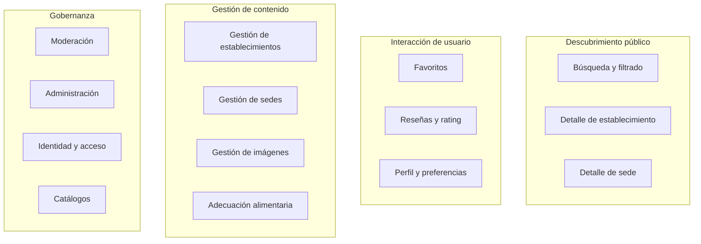

# Capacidades de negocio — Lyria

## Mapa de capacidades

## Capacidades detalladas por área

### Descubrimiento público

| Capacidad | Descripción | Actor principal | Prioridad |
|-----------|-------------|-----------------|-----------|
| Búsqueda textual | Buscar por nombre de establecimiento o sede | Visitor | MVP esencial |
| Filtrado por categoría | Seleccionar tipo de establecimiento | Visitor | MVP esencial |
| Filtrado por ubicación | Ordenar por cercanía geográfica | Visitor | MVP esencial |
| Filtrado por necesidades alimentarias | Filtrar sedes según condiciones alimentarias | Visitor | MVP esencial |
| Filtrado por servicios | Filtrar por servicios disponibles | Visitor | MVP esencial |
| Detalle de establecimiento | Información comercial, categorías, sedes | Visitor | MVP esencial |
| Detalle de sede | Dirección, horarios, servicios, imágenes, reseñas, adecuación | Visitor | MVP esencial |
| Paginación | Resultados paginados en todas las búsquedas | Visitor | MVP esencial |

### Interacción de usuario

| Capacidad | Descripción | Actor principal | Prioridad |
|-----------|-------------|-----------------|-----------|
| Registro | Creación de cuenta | Visitor -> User | MVP esencial |
| Inicio de sesión | Autenticación | User | MVP esencial |
| Gestión de perfil | Actualizar nombre, teléfono, foto | User | MVP esencial |
| Necesidades alimentarias | Configurar condiciones personales | User | MVP esencial |
| Agregar favorito | Guardar sede como favorita | User | MVP esencial |
| Eliminar favorito | Quitar sede de favoritos | User | MVP esencial |
| Listar favoritos | Consultar sedes favoritas | User | MVP esencial |
| Crear reseña | Rating y comentario sobre una sede | User | MVP esencial |
| Editar reseña | Modificar propia reseña existente | User | MVP esencial |
| Eliminar reseña | Eliminación lógica de propia reseña | User | MVP esencial |
| Reportar reseña | Reportar contenido inapropiado | User | MVP esencial |

### Gestión de contenido

| Capacidad | Descripción | Actor principal | Prioridad |
|-----------|-------------|-----------------|-----------|
| Crear establecimiento | Registro de nuevo establecimiento | Admin | MVP esencial |
| Actualizar establecimiento | Modificar datos comerciales | Manager / Admin | MVP esencial |
| Enviar a revisión | Solicitar aprobación de contenido | Manager | MVP secundario |
| Crear sede | Registrar nueva ubicación física | Manager / Admin | MVP esencial |
| Actualizar sede | Modificar datos de sede | Manager / Admin | MVP esencial |
| Gestionar horarios | Definir períodos de atención | Manager / Admin | MVP esencial |
| Gestionar servicios | Asignar servicios disponibles | Manager / Admin | MVP esencial |
| Gestionar imágenes | Subir, ordenar, marcar principal | Manager / Admin | MVP esencial |
| Proponer adecuación | Declarar adecuación alimentaria | Manager | MVP secundario |
| Verificar adecuación | Confirmar adecuación con evidencia | Moderator | MVP secundario |

### Gobernanza

| Capacidad | Descripción | Actor principal | Prioridad |
|-----------|-------------|-----------------|-----------|
| Moderar publicaciones | Aprobar o rechazar establecimientos y sedes | Moderator | MVP secundario |
| Moderar reseñas | Ocultar o restaurar reseñas | Moderator | MVP secundario |
| Resolver reportes | Procesar reportes de reseñas | Moderator | MVP secundario |
| Gestionar catálogos | CRUD de categorías, necesidades, servicios | Admin | MVP secundario |
| Gestionar usuarios | Consultar, activar, desactivar usuarios | Admin | MVP esencial |
| Gestionar roles | CRUD de roles y permisos | Admin | MVP esencial |
| Asignar roles | Vincular roles con alcance a usuarios | Admin | MVP esencial |
| Consultar auditoría | Revisar operaciones administrativas | Admin | MVP secundario |
